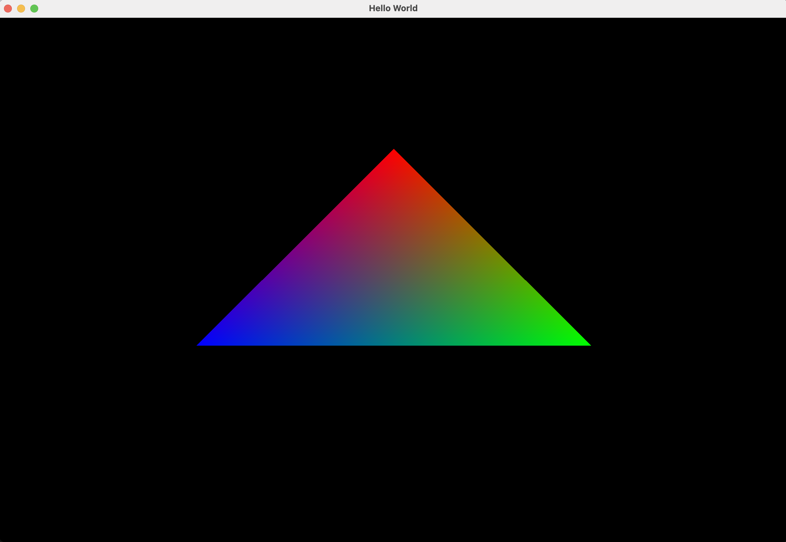

========
Overview
========

A beginner PyOpenGL program to create a triangle.

Preview
-------

*Expected output of the program*.

Set-Up
------

The program requires ``pyopengl`` and ``glfw``. To avoid version conflicts, it
is reccomended to install these packages in a new Python environment. To create
a new environment, from the command line:

.. code-block:: bash

    conda create -n my-env python=3.12

After creating the environment, activate it using:

.. code-block:: bash

    conda activate my-env

Then, install ``PyOpenGL`` and ``glfw`` using ``pip``:

.. code-block:: bash

    pip install PyOpenGL PyOpenGL_accelerate

    pip install glfw

Once ``PyOpenGL`` and ``glfw`` have been installed, you should be able to run
the program! 

Running the Program
-------------------

Download and unzip the project. Once the required packages have been installed
and the correct environment has been activated, the program can be run by
running ``main.py`` from any Python IDE, or from the command line using:

.. code-block:: bash

    python main.py
